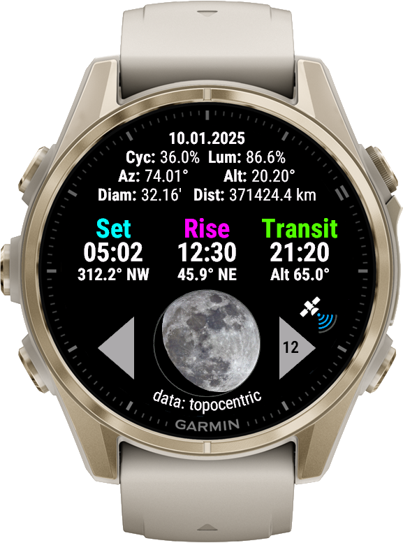

# Moon App & Simulator

Show data about the moon on your Garmin watch based upon your GPS position.

The app can be installed on Garmin watches via Garmin Connect IQ or Garmin Express from the [Garmin IQ Store](https://apps.garmin.com/apps/fb178fa4-b5df-4b29-ac2f-cae16b991766).

> [!IMPORTANT]
> The App requires API level 4.2.2 or higher on the watch.

The app shows the real-time moon data like rise, transit, and set times, cycle, fraction, azimuth, altitude, distance, zenith angle of crescent moon, next main moon phases, apogees, perigees etc. based on the GPS position of your watch (no internet or smartphone required). Some data is presented as diagrams (screenshots are available in the [documentation](./docs/img/)).

In each View you may switch to the following or previous days to show the moon data and charts during those days (requires touch screen enabled). Especially the charts need a lot of calculation in the background, so the change of the calculation day may take up to 3 seconds (depending on your watch).

If you actually don't receive GPS (or just if you want to know), you may switch to simulation mode (via Garmin Express or Connect IQ) to simulate a GPS position anywhere in the world. If the simulation mode is enabled, there will be an "S" with a red circle on the display.

Time zones and daylight saving times are calculated to the actual / simulated position (as stated by the Garmin firmware).

## Terms and conditions

**You are free to:**

- Share: copy and redistribute the material in any medium or format
- Adapt: remix, transform, and build upon the material

**Under the following terms:**

- Attribution: You must give appropriate credit , provide a link to the license, and indicate if changes were made . You may do so in any reasonable manner, but not in any way that suggests the licensor endorses you or your use.
- NonCommercial: You may not use the material for commercial purposes .
- ShareAlike: If you remix, transform, or build upon the material, you must distribute your contributions under the same license as the original.
- No additional restrictions: You may not apply legal terms or technological measures that legally restrict others from doing anything the license permits.

For detailed information, consult the [license](./LICENSE.txt).
